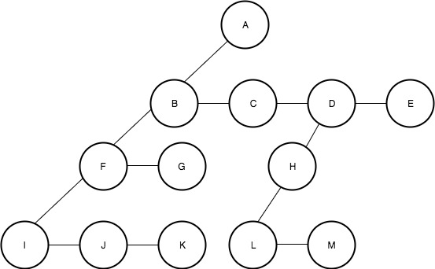

# Tree Child-Sibling Notation

In this method, we change the structure of the tree. In a standard tree, each parent node is connected to all of its children. However, in the **child-sibling notation**, a node stores a pointer to only one of its children. Additionally, the node also stores a pointer to its immediate right sibling. 

In this notation, every node has at most 2 children:
- **Left child** (first child),
- **Right sibling** (first sibling).

This structure is called the **LCRS (Left Child-Right Sibling)** notation. It effectively represents a binary tree, as every node has only two pointers (left and right).

<figure markdown="span">
{ width="90%" }
<figcaption> a tree notated with child-sibling notation</figcaption>
</figure>

## Why You Would Use the LCRS Notation

The primary reason for using LCRS notation is to save memory. In the LCRS structure, less memory is used compared to the standard tree notation.

### When You Might Use the LCRS Notation:

- **Memory is extremely scarce.**
- **Random access to a node’s children is not required.**

### Possible Cases for Using LCRS:

1. **When storing a large multi-way tree in main memory:**  
   For example, [the phylogenetic tree](https://en.wikipedia.org/wiki/Phylogenetic_tree).

2. **In specialized data structures where the tree is used in specific ways:**  
   For example, in the [**heap data structure**](https://en.wikipedia.org/wiki/Heap_%28data_structure%29), the main operations are:
   
   - Removing the root of the tree and processing each of its children,
   - Joining two trees together by making one tree a child of the other.

These operations can be done efficiently using the LCRS structure, making it convenient for working with heap data structures.

---

## References

- [LCRS article on Wikipedia](https://en.wikipedia.org/wiki/Left-child_right-sibling_binary_tree8)

- [Link to the Figure used](https://contribute.geeksforgeeks.org/wp-content/uploads/new.jpeg)

- [LCRS possible uses Stackoverflow](https://stackoverflow.com/questions/14015525/what-is-the-left-child-right-sibling-representation-of-a-tree-why-would-you-us)